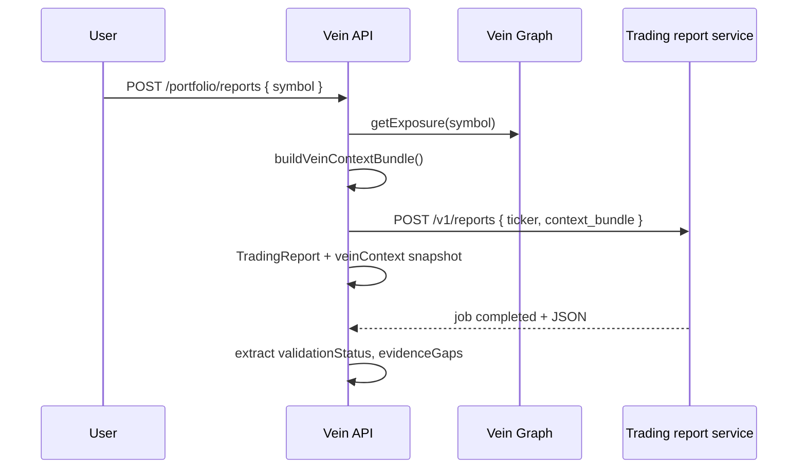

# Trading report — Vein context bundle

Supply-chain intelligence from Vein is attached when enqueueing jobs on the external
TradingAgents report service. This closes gaps seen in reports like the TSLA example
(news vacuum, no EV-sector context, unverified strategic claims) by giving the report
engine **structural evidence** and **peer tickers** for wider news/social queries.

**Related:** [trading-report-service-vein-integration.md](./trading-report-service-vein-integration.md) (handoff doc for the report service team),
[product-analytics-event-schema.md](./product-analytics-event-schema.md),
[moat-roadmap.md](./moat-roadmap.md) Phase C.

---

## Flow



---

## External API contract

### Request (additive)

`POST /v1/reports` — existing fields unchanged; optional:

```json
{
  "ticker": "TSLA",
  "analysis_date": "2026-06-30",
  "report_tier": "pro",
  "user_id": "…",
  "output_language": "en",
  "context_bundle": { }
}
```

The TradingAgents service uses `context_bundle` to:

1. Run a **Supply Chain Analyst** pass (chokepoints, downstream products, related suppliers).
2. Widen **news/social** tool queries with `peer_tickers_for_news` when primary ticker returns zero articles.
3. Treat `has_graph_coverage: false` as “no Vein structural data” — do not invent supply-chain claims.
4. Preserve machine-readable validation and dashboard artifacts for downstream UI state.

Backward compatible: omitting `context_bundle` behaves as today.

Important instrument rule: `context_bundle.primary_symbol` must match the submitted
`ticker`. If Vein means coffee futures, send `ticker: "KC=F"` and
`primary_symbol: "KC=F"`; sending `ticker: "KC"` resolves to a different listed
instrument and the validator will treat the supply-chain context as non-authoritative.

---

## `context_bundle` schema (`vein-context-v1`)

Built by `apps/api/src/trading-reports/vein-context.ts` from `GraphAnalysisService.getExposure()`.

| Field | Type | Purpose |
|-------|------|---------|
| `version` | `"vein-context-v1"` | Schema version |
| `primary_symbol` | string | Watchlist ticker |
| `has_graph_coverage` | boolean | `false` if ticker not in Vein Graph |
| `company` | object \| null | Resolved company entity |
| `anchor_elements` | `{ name }[]` | Products/services the ticker is traded against |
| `downstream_products` | object[] | Second-order dependents (picks & shovels) |
| `related_companies` | object[] | Peer/supplier tickers in the same neighbourhood |
| `chokepoints` | object[] | High-risk nodes (from products + via-chokepoint links) |
| `peer_tickers_for_news` | string[] | **News widening** — up to 24 symbols, excludes primary |
| `watchlist_notes` | string \| null | User notes from watchlist (personal framing) |
| `generated_at` | ISO datetime | Bundle build time |

### Example (TSLA, graph coverage)

```json
{
  "version": "vein-context-v1",
  "primary_symbol": "TSLA",
  "has_graph_coverage": true,
  "company": {
    "name": "Tesla, Inc.",
    "symbol": "TSLA",
    "is_chokepoint": false
  },
  "anchor_elements": [{ "name": "Electric vehicles" }],
  "downstream_products": [
    {
      "name": "EV battery packs",
      "category": "energy",
      "hops": 1,
      "is_chokepoint": true
    }
  ],
  "related_companies": [
    {
      "symbol": "ALB",
      "name": "Albemarle Corporation",
      "via": "Lithium refining",
      "via_chokepoint": true
    }
  ],
  "chokepoints": [
    { "name": "EV battery packs", "category": "energy", "hops": 1 },
    { "name": "Lithium refining", "category": null, "hops": 0, "via": "ALB" }
  ],
  "peer_tickers_for_news": ["ALB"],
  "watchlist_notes": "Watch margin and China exposure",
  "generated_at": "2026-06-30T12:00:00.000Z"
}
```

---

## Persistence (`TradingReport`)

| Column | When set | Use |
|--------|----------|-----|
| `veinContext` | On create | Snapshot sent to external service; audit / replay |
| `validationStatus` | On sync complete | e.g. `REPORT_BLOCKED` |
| `evidenceGaps` | On sync complete | Parsed gap bullets + news-vacuum detection |

Extracted by `report-metadata.ts` from TradingAgents JSON (`final_state`, analyst markdown).

---

## Implementation status

| Item | Status |
|------|--------|
| `buildVeinContextBundle` + unit tests | ✅ |
| `context_bundle` on external create | ✅ |
| `veinContext` / `validationStatus` / `evidenceGaps` columns | ✅ |
| Metadata extraction on sync | ✅ |
| API response includes new fields | ✅ |
| Trading service consumes bundle | ✅ implemented in TradingAgents |
| Supply Chain Analyst section in PDF | ✅ implemented in TradingAgents |
| Peer-news widening when primary news is empty | ✅ implemented in TradingAgents |
| No-coverage guardrail | ✅ implemented in TradingAgents |
| Persisted job polling metadata | ✅ implemented in TradingAgents |
| User report feedback (useful / not) | ⬜ follow-up |

### TradingAgents implementation notes

The TradingAgents service now accepts `context_bundle` on `POST /v1/reports`.
For pro-tier jobs, a supplied bundle automatically adds the `supply_chain`
analyst. The generated state includes `vein_context_bundle` and
`supply_chain_report`, and the report writer saves the analyst output under
`1_analysts/supply_chain.md`.

When primary ticker news is empty, the service uses
`peer_tickers_for_news` as supplemental supply-chain peer news. Peer articles
are marked as `vein_peer_news` and remain supply-chain-adjacent context, not
direct company news.

Validation blocks:

- `context_bundle.primary_symbol` mismatches
- supply-chain claims when `has_graph_coverage` is `false`
- recommendation language inside `supply_chain_report`

The report API also persists job metadata under `_jobs/<job_id>.json` so
polling can survive API worker changes or process restarts.

Current artifact endpoints:

| Endpoint | Purpose |
|----------|---------|
| `GET /v1/reports/{job_id}` | Job status plus artifact URLs |
| `GET /v1/reports/{job_id}/pdf` | Generated PDF |
| `GET /v1/reports/{job_id}/json` | Full final-state JSON |
| `GET /v1/reports/{job_id}/dashboard` | Canonical public recommendation/action |
| `GET /v1/reports/{job_id}/validation` | Validation status and blocking issues |
| `GET /v1/reports/{job_id}/evidence` | Decision evidence bundle |

---

## Future extensions (v2)

- Attach last **scenario.run** for the ticker’s product node (blast radius).
- Include **Vein Score** tier for anchor chokepoints.
- Pass **evidence level** per edge (`filing-confirmed` vs `AI-asserted`).
- Link **recent user trace** id when report is generated from portfolio after tracing.
- `contagion` summary if anchor chokepoint is disrupted.

---

## Privacy

- `watchlist_notes` are user-authored; respect zero-retention / enterprise policies before using in aggregate training.
- `veinContext` contains no raw trace graphs — only normalized graph projections.
- Do not log full `reportData` in application logs; store in DB only.
